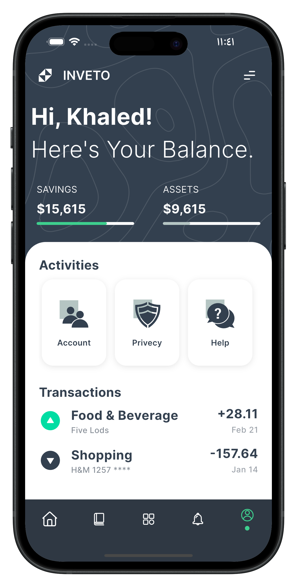
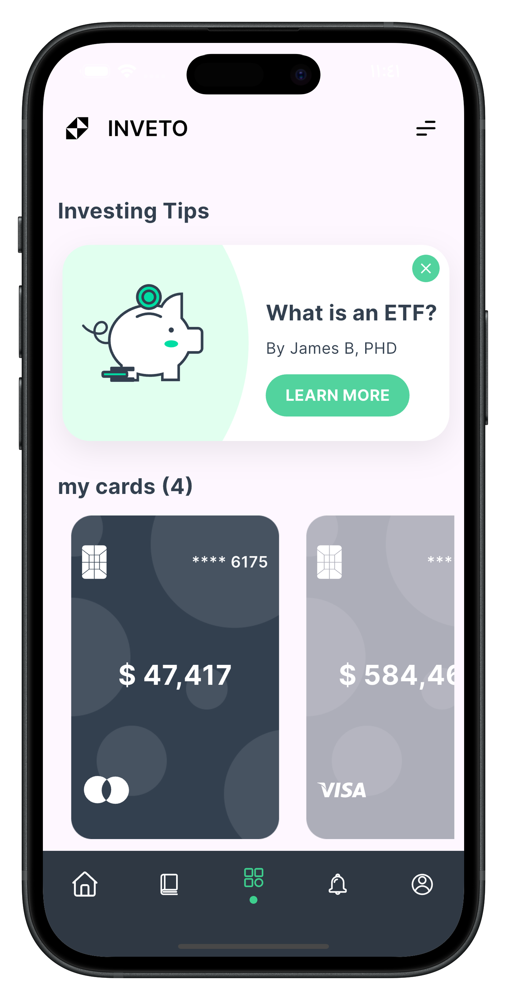
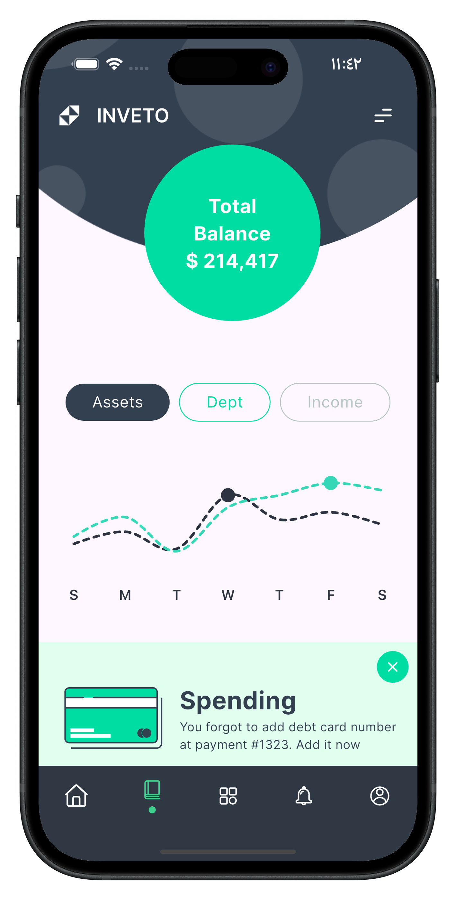

# fintech_banking_investing_ui

A sleek financial management app built with Flutter that helps users track savings, assets, and spending through an elegant dashboard. Features include real-time balance updates, interactive charts, investment tips, and secure multi-card management — all wrapped in a clean, modern UI for a seamless fintech experience.

## Screenshots

  

  

  

